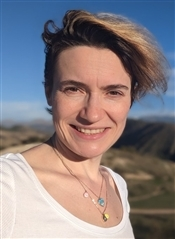
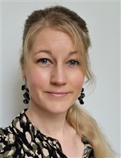
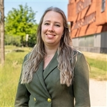
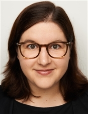
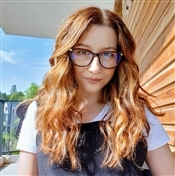
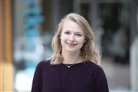
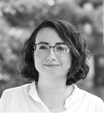

<!--  -->

<!-- **Did you attend Alice & Eve 2024? Please fill out our feedback form: [https://forms.gle/cFKzTXHZQpLtyMY17](https://forms.gle/cFKzTXHZQpLtyMY17)**-->

Welcome to our free one-day workshop for celebrating women studying and working in computing!
Alice & Eve aims to bring together talents in the field of computing. The sixth edition of this workshop will be hosted on **20 October 2026** by Utrecht University.

<!--
Alice and Eve event is inspired by the [BCS Lovelace Colloquium](https://bcswomenlovelace.bcs.org/) that started in 2008. For more details about earlier editions of Alice & Eve, see the websites of [2020](https://fmt.ewi.utwente.nl/events/aliceandeve2020/), [2021](https://aliceandeve.cs.ru.nl/), [2022](https://alice-and-eve.github.io/2022/), [2023](https://alice-and-eve.github.io/2023/) and [2024](https://alice-and-eve.github.io/2024/).-->

Alice and Eve event is inspired by the <a href="https://bcswomenlovelace.bcs.org/" target="_blank" rel="noopener noreferrer">BCS Lovelace Colloquium</a> that started in 2008. For more details about earlier editions of Alice & Eve, see the websites of <a href="https://fmt.ewi.utwente.nl/events/aliceandeve2020/" target="_blank" rel="noopener noreferrer">2020</a>, <a href="https://aliceandeve.cs.ru.nl/" target="_blank" rel="noopener noreferrer">2021</a>, <a href="https://alice-and-eve.github.io/2022/" target="_blank" rel="noopener noreferrer">2022</a>
, <a href="https://alice-and-eve.github.io/2023/" target="_blank" rel="noopener noreferrer">2023</a>, <a href="https://alice-and-eve.github.io/2024/" target="_blank" rel="noopener noreferrer">2024</a>, and <a href="https://alice-and-eve.github.io/2025/" target="_blank" rel="noopener noreferrer">2025</a>.

The event is held during a single day, and features:

- keynote talks,
- a poster contest, and
- an exhibition on women in computing.

Join us, and participate to our poster contest on the topic of your choice!

### Date:

Alice & Eve will take place on October 20, 2026.

### Venue:

The workshop will be held at Neude11 Utrecht Public Library in Utrecht.
<iframe src="https://www.google.com/maps/embed?pb=!1m18!1m12!1m3!1d2451.263801842379!2d5.115589777229807!3d52.093130367745275!2m3!1f0!2f0!3f0!3m2!1i1024!2i768!4f13.1!3m3!1m2!1s0x47c66fb608dec653%3A0x1534cabcac5d031c!2sNeude11!5e0!3m2!1sen!2snl!4v1776239702623!5m2!1sen!2snl" width="600" height="450" style="border:0;" allowfullscreen="" loading="lazy" referrerpolicy="no-referrer-when-downgrade"></iframe>

<!-- <iframe src="[https://www.google.com/maps/embed?pb=!1m18!1m12!1m3!1d4894.777675507259!2d4.489776676910258!3d52.16362346255315!2m3!1f0!2f0!3f0!3m2!1i1024!2i768!4f13.1!3m3!1m2!1s0x47c5c6935ca128d3%3A0x8979448a419f89c4!2sPLNT%20Leiden!5e0!3m2!1sen!2snl!4v1727699287973!5m2!1sen!2snl]" width="600" height="450" style="border:0;" allowfullscreen="" loading="lazy" referrerpolicy="no-referrer-when-downgrade"></iframe> -->

<!-- <iframe src="https://www.google.com/maps/embed?pb=!1m18!1m12!1m3!1d2447.751991104805!2d4.482933476457672!3d52.15701986304036!2m3!1f0!2f0!3f0!3m2!1i1024!2i768!4f13.1!3m3!1m2!1s0x47c5c6f2447daae3%3A0x48e9dc4f075bb167!2z6I6x6aG_5aSn5a2m!5e0!3m2!1szh-CN!2snl!4v1710771504599!5m2!1snl!2snl" width="600" height="450" style="border:0;" allowfullscreen="" loading="lazy" referrerpolicy="no-referrer-when-downgrade"></iframe> -->

### Registration:

Register here: <a href="https://alice-and-eve.github.io/2026/registration" target="_blank" rel="noopener noreferrer">https://alice-and-eve.github.io/2026/registration</a>

## Program

| Time | Session |
|------|---------|
| 09:30 – 10:00 | Registration and Coffee |
| 10:00 – 10:10 | Opening |
| 10:10 – 10:40 | Talk on Knowledge Engineering |
| 10:40 – 11:10 | Talk on Machine Learning |
| 11:10 – 11:30 | ☕ Coffee Break |
| 11:30 – 12:00 | Talk on Human–Computer Interaction |
| 12:00 – 12:30 | Talk on Algorithms |
| 12:30 – 14:00 | 🍽 Lunch Break & Exhibition |
| 14:00 – 14:30 | Sponsor Lightning Talks |
| 14:30 – 15:00 | Talk on Computer Networks |
| 15:00 – 15:30 | ☕ Coffee Break |
| 15:30 – 16:00 | Talk on Security |
| 16:00 – 16:15 | Poster Awards |
| 16:15 – 17:00 | Panel on "Resilience in Computing" |
| 17:00 – 17:10 | Closing |
| 17:10 – 18:00 | 🥂 Drinks |

## Poster Contest

We are thrilled to announce the Alice & Eve 2026 poster contest with exciting prizes awaiting the winners!

We invite all female students (Bachelor/Master/PhD) and early career researchers of computing and related subjects (in the broadest sense) to submit a poster. Your poster can be on any computing topic you like: from social networking to quantum computing and from medical image processing to formal verification. If it involves computers, we are interested. We welcome you to reuse any existing/published work or poster, no need to print it again.

To enter the poster contest, please write a half-page abstract (word limit: 250 words) on the topic of your poster and submit it by **15 September 2026** via EasyChair: <a href="https://easychair.org/conferences/?conf=aliceeve2026" target="_blank" rel="noopener noreferrer">https://easychair.org/conferences/?conf=aliceeve2026</a>

Notifications will be sent out by **25 September 2026**. Selected participants are expected to bring the poster (up to size A0 portrait or A1 landscape) described by their abstract with them to Utrecht to present during the poster session. At the end of the day, prizes will be awarded for the winning posters in each category.

If you have any questions, don't hesitate to get in touch: <a href="mailto:alice.eve@uu.nl">alice.eve@uu.nl</a>. We look forward to seeing you in Utrecht!

## Exhibition

TBD

## Speakers

TBD

## Jobs Board

TBD

## Organizing Committee

  

    
    

      <a href="https://www.uu.nl/staff/KLabunets">Kate Labunets</a>General Co-Chair 
      Utrecht University 
      Netherlands
    

  

  

    
    

      <a href="https://www.uu.nl/staff/MMAdeGraaf">Maartje de Graaf</a>General Co-Chair 
      Utrecht University 
      Netherlands
    

  

  

    
    

      <a href="https://www.uu.nl/staff/IRvanEngelenhovenLenting">Kimberley van Engelenhoven-Lenting</a>Local Chair 
      Utrecht University 
      Netherlands
    

  

  

    
    

      <a href="https://www.uu.nl/staff/MRadli">Martina Radli</a>Administration Liaison 
      Utrecht University 
      Netherlands
    

  

  

    
    

      <a href="https://www.uu.nl/staff/HJHauptmann">Hanna Hauptmann</a>Program Chair 
      Utrecht University 
      Netherlands
    

  

  

    
    

      <a href="https://www.uu.nl/staff/RTRadulescu">Roxana Radulescu</a>Poster Chair 
      Utrecht University 
      Netherlands
    

  

  

    
    

      <a href="https://www.uu.nl/staff/SSKerkhove">Sylvia Kerkhove</a>Finance &amp; Sponsors 
      Utrecht University 
      Netherlands
    

  

  

    
    

      <a href="https://www.uu.nl/staff/KDinnissen">Karlijn Dinnissen</a>Communication Co-Chair 
      Utrecht University 
      Netherlands
    

  

  

    
    

      <a href="https://www.uu.nl/medewerkers/FBAydemir">Fatma Başak Aydemir</a>Communication Co-Chair 
      Utrecht University 
      Netherlands
    

  

## Steering committee

- [Marieke Huisman](https://people.utwente.nl/m.huisman), Universiteit Twente (UT)
- [Mariëlle Stoelinga](https://personen.utwente.nl/m.i.a.stoelinga), Universiteit Twente (UT)
- [Sophie Lathouwers](https://www.sophielathouwers.nl/), TNO
- [George Fletcher](https://www.tue.nl/en/research/researchers/george-fletcher), Eindhoven University of Technology
- [Machiel van der Bijl](https://www.axini.com/nl/about/), Axini
- [Lu Cao](https://www.universiteitleiden.nl/en/staffmembers/lu-cao#tab-1), Leiden University
- [Jiapan Guo](https://www.rug.nl/staff/j.guo/), University of Groningen
- [Fatma Başak Aydemir](https://www.uu.nl/medewerkers/FBAydemir), Utrecht University

## Code of Conduct
Alice and Eve is dedicated to providing a harassment-free conference experience for everyone, regardless of gender, gender identity and expression, sexual orientation, disability, physical appearance, body size, race, age or religion. We do not tolerate harassment of conference participants in any form. Conference participants violating these rules may be sanctioned or expelled from the conference at the discretion of the conference organizers.
Harassment includes, but is not limited to:
- Verbal comments that reinforce social structures of domination related to gender, gender identity and expression, sexual orientation, disability, physical appearance, body size, race, age, religion.
- Sexual images in public spaces
- Deliberate intimidation, stalking, or following
- Harassing photography or recording
- Sustained disruption of talks or other events
- Inappropriate physical contact
- Unwelcome sexual attention
- Advocating for, or encouraging, any of the above behaviour

Participants asked to stop any harassing behavior are expected to comply immediately. If someone makes you or anyone else feel unsafe or unwelcome, please report it as soon as possible by contacting us ether in person or via email.

<!--
Ilaria Battiston (either in person or via [email](mailto:Ilaria Battiston <ilaria@cwi.nl>)) or Iris Groen (either in person or via [email](mailto:Iris Groen <i.i.a.groen@uva.nl>)).

This Code of Conduct was adapted from the [Geek Feminism Wiki anti-harassment policy](https://geekfeminism.fandom.com/wiki/Conference_anti-harassment/Policy).
-->

This Code of Conduct was adapted from the <a href="https://geekfeminism.fandom.com/wiki/Conference_anti-harassment/Policy" target="_blank" rel="noopener noreferrer">Geek Feminism Wiki anti-harassment policy</a>.

## Sponsors

Interested in sponsoring Alice & Eve 2026? We'd love to hear from you — please contact our sponsor chair at <a href="mailto:s.s.kerkhove@uu.nl">s.s.kerkhove@uu.nl</a>.

**🥉 Bronze Sponsors**

  

**🥇 Gold Sponsors**

  
  

## Contact Us

For any questions, feel free to reach out to us at <a href="mailto:alice.eve@uu.nl">alice.eve@uu.nl</a>.

## About Utrecht

Utrecht is one of the Netherlands' oldest and most vibrant cities, located right at the heart of the country. It is home to the iconic Dom Tower, medieval canal wharves, world-class museums, and three UNESCO World Heritage Sites. Utrecht Centraal station is the largest railway hub in the Netherlands — just 30 minutes from Amsterdam and 35–40 minutes from Schiphol Airport.

[Read more about Utrecht →](/aboutUtrecht)

## Accommodation

TBD