<!--  -->

<!-- **Did you attend Alice & Eve 2024? Please fill out our feedback form: [https://forms.gle/cFKzTXHZQpLtyMY17](https://forms.gle/cFKzTXHZQpLtyMY17)**-->

Welcome to our free one-day workshop for celebrating women studying and working in computing!
Alice & Eve aims to bring together talents in the field of computing. The seventh edition of this workshop will be hosted on **20 October 2026** by Utrecht University.

<!--
Alice and Eve event is inspired by the [BCS Lovelace Colloquium](https://bcswomenlovelace.bcs.org/) that started in 2008. For more details about earlier editions of Alice & Eve, see the websites of [2020](https://fmt.ewi.utwente.nl/events/aliceandeve2020/), [2021](https://aliceandeve.cs.ru.nl/), [2022](https://alice-and-eve.github.io/2022/), [2023](https://alice-and-eve.github.io/2023/) and [2024](https://alice-and-eve.github.io/2024/).-->

Alice and Eve event is inspired by the [BCS Lovelace Colloquium](https://bcswomenlovelace.bcs.org/){:target="_blank" rel="noopener noreferrer"} that started in 2008. For more details about earlier editions of Alice & Eve, see the websites of [2020](https://fmt.ewi.utwente.nl/events/aliceandeve2020/){:target="_blank" rel="noopener noreferrer"}, [2021](https://aliceandeve.cs.ru.nl/){:target="_blank" rel="noopener noreferrer"}, [2022](https://alice-and-eve.github.io/2022/){:target="_blank" rel="noopener noreferrer"}
, [2023](https://alice-and-eve.github.io/2023/){:target="_blank" rel="noopener noreferrer"}, [2024](https://alice-and-eve.github.io/2024/){:target="_blank" rel="noopener noreferrer"}, and [2025](https://alice-and-eve.github.io/2025/){:target="_blank" rel="noopener noreferrer"}.

The event is held during a single day, and features:

- keynote talks
- a poster contest
- an exhibition on women in computing
- ample networking opportunities

Join us, and participate in our poster contest on the topic of your choice!

### Date:

Alice & Eve will take place on October 20, 2026, between 9:30 and 18:00 CEST.

### Venue and How to Get There:

The workshop will be held at Neude11 Utrecht Public Library in Utrecht.
<iframe src="https://www.google.com/maps/embed?pb=!1m18!1m12!1m3!1d2451.263801842379!2d5.115589777229807!3d52.093130367745275!2m3!1f0!2f0!3f0!3m2!1i1024!2i768!4f13.1!3m3!1m2!1s0x47c66fb608dec653%3A0x1534cabcac5d031c!2sNeude11!5e0!3m2!1sen!2snl!4v1776239702623!5m2!1sen!2snl" width="600" height="450" style="border:0;" allowfullscreen="" loading="lazy" referrerpolicy="no-referrer-when-downgrade"></iframe>

<!-- <iframe src="[https://www.google.com/maps/embed?pb=!1m18!1m12!1m3!1d4894.777675507259!2d4.489776676910258!3d52.16362346255315!2m3!1f0!2f0!3f0!3m2!1i1024!2i768!4f13.1!3m3!1m2!1s0x47c5c6935ca128d3%3A0x8979448a419f89c4!2sPLNT%20Leiden!5e0!3m2!1sen!2snl!4v1727699287973!5m2!1sen!2snl]" width="600" height="450" style="border:0;" allowfullscreen="" loading="lazy" referrerpolicy="no-referrer-when-downgrade"></iframe> -->

<!-- <iframe src="https://www.google.com/maps/embed?pb=!1m18!1m12!1m3!1d2447.751991104805!2d4.482933476457672!3d52.15701986304036!2m3!1f0!2f0!3f0!3m2!1i1024!2i768!4f13.1!3m3!1m2!1s0x47c5c6f2447daae3%3A0x48e9dc4f075bb167!2z6I6x6aG_5aSn5a2m!5e0!3m2!1szh-CN!2snl!4v1710771504599!5m2!1snl!2snl" width="600" height="450" style="border:0;" allowfullscreen="" loading="lazy" referrerpolicy="no-referrer-when-downgrade"></iframe> -->

Once inside the library, follow the signs to ’Theaterzaal’ and/or ‘Alice & Eve'. 
 
We encourage attendees to take public transport to travel to Utrecht Central Station.
From there, the library is approximately a 10-minute walk via Vredenburg and Potterstraat.
To take the bus from Utrecht Central Station, take bus lines 2, 8, 28, 50, 55, 73, 74 or 77 and get off at Neude. 
 
If you are traveling by car, please note that there is no parking directly at the library. Parking is possible at Interparking Hoog Catharijne P1, P4 or P5, or at Q-Park La Vie. The library is approximately a 5–10 minute walk from each location.

### Registration:

Register here: [Alice & Eve 2026 Registration Form](https://survey.uu.nl/jfe/form/SV_5hTToBoMnqdtpZ4){:target="_blank" rel="noopener noreferrer"}

Please note the registration deadline is **11 October**, so we can accurately plan catering.

## Program

<table>
<thead>
<tr>
<th>Time</th>
<th>Session</th>
</tr>
</thead>
<tbody>
<tr>
<td>09:30 – 10:00</td>
<td>Registration and Coffee</td>
</tr>
<tr>
<td>10:00 – 10:10</td>
<td>Opening</td>
</tr>
<tr>
<td>10:10 – 10:40</td>
<td>Keynote talk by Laura Hollink on <b>Bias in Knowledge Graphs:</b>

Knowledge graphs are structured representations of real-world entities and their relationships, forming the backbone of a wide range of applications — from powering search interfaces and recommendation systems to serving as training data for large language models. Yet despite their growing influence, bias in knowledge graphs remains a largely overlooked problem compared to the broader discourse on bias in AI.
          Bias enters knowledge graphs inevitably: they are constructed by humans, or derived from human-generated data, and thus inherit the skewed perspectives, gaps, and prejudices embedded in their sources. This talk offers a structured overview of bias in knowledge graphs across two dimensions: quantitative and qualitative. Quantitative bias concerns disparities in representation, such as unequal numbers of nodes or edges associated with different groups of people. Such imbalances carry real consequences: downstream applications like recommender systems and entity alignment tasks have been shown to systematically favor entities with richer data, amplifying existing inequalities. Qualitative bias manifests in the language used to describe people and cultures within a graph's literal values. Drawing on domain expertise from the cultural heritage sector, where questions of inclusion and fair representation have received sustained attention, we demonstrate how biased terminology can be identified in knowledge graph literals. The talk closes with an overview of mitigation efforts by knowledge graph creators, offering both practical tools and a call to action for the field.

          

</td>
</tr>
<tr>
<td>10:40 – 11:10</td>
<td>Keynote talk by Pınar Yolum on <b>Human–AI Collaboration Beyond Prediction:</b>

As humans increasingly collaborate with AI agents, effective collaboration depends on combining complementary strengths rather than replacing human judgment. Effective collaboration requires AI systems to model and adapt to human preferences, social norms, values, and context, and to exhibit capabilities such as empathy, self-reflection, and social awareness in ways that support interaction. This raises fundamental questions: how should we represent these capabilities computationally, how can they be learned from data and interaction, and how should they be evaluated? Privacy provides a particularly rich domain for exploring these challenges. I will present our work on privacy assistants that reason about norms, contexts, and values to help people make informed decisions in complex data-sharing environments.

</td>
</tr>
<tr>
<td>11:10 – 11:30</td>
<td>☕ Coffee Break</td>
</tr>
<tr>
<td>11:30 – 12:00</td>
<td>Keynote talk by Vanessa Evers on <b>Deploying Physical AI in Society:</b>

In futurist research, we envision new (Physical) AI possibilities and think through the consequences of these (im)possible innovations for people and their impact on society. In imagining a future symbiotic society with robots and people and in developing Social AI and Social robotics solutions, we have been imagining what future physical AI services may look like, how to innovate technologically to make the solution come true and study the social and societal consequences. In this presentation I will discuss projects in which we created robotic technology; explain how we went about designing integrated AI driven robots that were envisioned to operate in everyday environments and how we studied the impact of these controversial technologies on people’s lives. Also, there will be a lot of interesting videos to watch as we learned to make robots for people through trial and error.

</td>
</tr>
<tr>
<td>12:00 – 12:30</td>
<td>Keynote talk by Maria Vlasiou on <b>Stochastic Processes on Interacting Networks:</b>

Many systems in science and engineering can be viewed as collections of stochastic processes that interact through dynamic networks. Classical approaches typically assume fixed structures or independent components, but contemporary systems—ranging from communication platforms and service ecosystems to mobility networks and biological systems—evolve while operating. Their behaviour emerges from feedback between random flows, changing topologies, and state dependent interactions. This lecture surveys recent developments in stochastic processes on interacting networks. I will discuss models that capture how randomness, dependence, and network evolution shape collective dynamics, highlighting tractable results on stability, scaling limits, and approximation methods.

</td>
</tr>
<tr>
<td>12:30 – 13:45</td>
<td>🍽 Lunch Break &amp; Exhibition</td>
</tr>
<tr>
<td>13:45 – 14:30</td>
<td>Sponsor Lightning Talks 
Nantia Markynioti from <b>DuckDB Labs</b> on "DuckDB: From academic research to AWS" 
Anna Hu from <b>AFAS</b> on "My journey from Graduation to the AI Team at AFAS Software" 
Garazi Muguruza Lasa from <b>SURF</b> on "Quantum technologies at SURF" 
Lynda Hardman from <b>CWI</b> on "Why would I want to study Computer Science?"
</td>
</tr>
<tr>
<td>14:30 – 15:00</td>
<td>Keynote talk by Özlem Durmaz Incel on <b>Pervasive Sensing Systems at the Edge:</b>

Pervasive systems consist of networks of sensing, computing, and reasoning components embedded so seamlessly into their environment that they become unnoticed. These form a kind of digital skin, allowing us to perceive the world through numerous small, imperfect, interconnected devices. In this talk, I will outline the research conducted by the Pervasive Systems group at the University of Twente, using examples such as earbuds capable of detecting distraction or recognizing silent speech, bicycles transformed into mobile edge nodes for safer cycling, and sensor networks deployed in the field for biodiversity monitoring. Common challenges across these projects include scaling sensing efforts, running intelligent processing on low-power devices, and building reliable systems from unreliable components.

</td>
</tr>
<tr>
<td>15:00 – 15:30</td>
<td>☕ Coffee Break</td>
</tr>
<tr>
<td>15:30 – 16:00</td>
<td>Keynote talk by Christine Utz on <b>Apps, AI, and Your Data: How Much Do We Really Know?:</b>

AI is no longer confined to chatbots and AI-native applications but increasingly embedded in the everyday apps we use, from online shops to video players. But how transparent are companies about these capabilities and the role our data play in developing AI?
          In this talk, I'll share findings from a current study of how popular apps communicate their use of AI and AI-related data practices, what choices they give users, and how easy those choices are to find and exercise. We'll also look at the role of deceptive design and what it can mean for privacy, transparency, and user control. The talk presents some of the different approaches apps take - and some of the unexpected ways AI-related data practices are communicated to users.

</td>
</tr>
<tr>
<td>16:00 – 16:15</td>
<td>Poster Awards</td>
</tr>
<tr>
<td>16:15 – 17:00</td>
<td>Panel on “Resilience in Computing”</td>
</tr>
<tr>
<td>17:00 – 17:10</td>
<td>Closing</td>
</tr>
<tr>
<td>17:10 – 18:00</td>
<td>🥂 Drinks</td>
</tr>
</tbody>
</table>

## Poster Contest

We are thrilled to announce the Alice & Eve 2026 poster contest with exciting prizes awaiting the winners!

Please find the list of accepted posters below:

<table>
  <thead>
    <tr>
      <th>Author(s)</th>
      <th>Title</th>
    </tr>
  </thead>
  <tbody>
    <tr>
      <td>Ahdiyeh Alipour, Kousar Aslam, Tilo Hartmann, Roel Dobbe and Maryam Alimardani</td>
      <td>Designing Inclusive and Responsible AI Agents for Diverse User Groups</td>
    </tr>
    <tr>
      <td>Adriana Neves</td>
      <td>A Device-Generalizable Approach to Automated Eye Image Analysis</td>
    </tr>
    <tr>
      <td>Anja Helena Margaretha Jager</td>
      <td>Fair Division under Uncertainty</td>
    </tr>
    <tr>
      <td>Brigitta Varga</td>
      <td>pip install refs-mcc: Out-of-the-Box Feature Selection for High-Dimensional, Low-Sample-Size Omics Data</td>
    </tr>
    <tr>
      <td>Cheryl Andrea Fernando</td>
      <td>When Alice blocked Eve... Wait, how did you know?</td>
    </tr>
    <tr>
      <td>Cheryl Andrea Fernando</td>
      <td>Traffic at 3am?</td>
    </tr>
    <tr>
      <td>Cyrine Fekih, Dennis Soemers, Ashish Sai and Adriana Iamnitchi</td>
      <td>Learning Insider-Threat Intervention Policies from Offline Logs</td>
    </tr>
    <tr>
      <td>Francisca Pessanha</td>
      <td>Emotion through Breath in the VO-ACTUP dataset</td>
    </tr>
    <tr>
      <td>Heleen Kerstholt, Catarina Marques Santos and Ioanna Lykourentzou</td>
      <td>Collaborating with GenAI in teams: the relation of critical thinking, GenAI usage and team dynamics</td>
    </tr>
    <tr>
      <td>Justine Poon and Malou Van der Velde</td>
      <td>"Nailing" Real-World AI: Smartphone Health Screening Beyond the Lab</td>
    </tr>
    <tr>
      <td>Kaouther Mouheb</td>
      <td>Do Medical AI Models See African Brains Fairly?</td>
    </tr>
    <tr>
      <td>Laura van der Lubbe and Sylvia van Borkulo</td>
      <td>Digital platforms for acessible K-12 computer science</td>
    </tr>
    <tr>
      <td>Linde Huijben and L.L. Sharon Ong</td>
      <td>Comparing the Robustness of YOLO-Based Architectures for Detecting Personal Protective Equipment (PPE)</td>
    </tr>
    <tr>
      <td>Lin Wouters, Johannes Textor and Inge Wortel</td>
      <td>Fitting fast, but not furiously: speeding up parameter fitting in stochastic simulators using variance reduction</td>
    </tr>
    <tr>
      <td>Mae Sosto, Laura Hollink and Davide Ceolin</td>
      <td>Rainbow Meter: Evaluating Factual Accuracy and Stance in LLMs on LGBTI Rights Across Languages and Countries</td>
    </tr>
    <tr>
      <td>Mary Chris Go, Daniël M Pelt, Anirudh Kohli, Philip W Withers and K Joost Batenburg</td>
      <td>Fibre phantom generation using FibreSimulator: an open-source Python tool</td>
    </tr>
    <tr>
      <td>Martina Dossi, Shivam Agarwal, Madhav Poddar, Fabian Beck and Angelos Chatzimparmpas</td>
      <td>OrCaPCP: Overlapping Categories Parallel Coordinates Plots</td>
    </tr>
    <tr>
      <td>Martina Tébar</td>
      <td>Integrating Holder-Binding into an Identity Wallet with Facial Verification and Liveness Detection</td>
    </tr>
    <tr>
      <td>Pien Rooijendijk</td>
      <td>Who Said CVE? How Vulnerability Identifiers Are Mentioned by Humans, Bots, and Agents in Pull Requests</td>
    </tr>
    <tr>
      <td>Rosie Zheng, Herke van Hoof and Maryam Alimardani</td>
      <td>Improving Human-Robot Collaboration Using Brain-Computer Interfaces: A Systematic Review</td>
    </tr>
    <tr>
      <td>Rui Li</td>
      <td>Evaluating Explainable Clustering Methods for Android Malware Family Attribution</td>
    </tr>
    <tr>
      <td>Ru Dahm</td>
      <td>Femicide in Dutch news articles: a computational analysis on historical corpora</td>
    </tr>
    <tr>
      <td>Sagar Simha, Juliette Ortholand, Georgios Mavrakis, Dave Dongelmans, Jessica Workum, Olivier Thijssens, Ameen Abu-Hanna and Giovanni Cinà</td>
      <td>Comparing Treatment Discontinuation Strategies When Covariate Monitoring Stops</td>
    </tr>
    <tr>
      <td>Shuang Sun and Olga Gadyatskaya</td>
      <td>A Study of Cursorules Files in GitHub Open Source Projects</td>
    </tr>
    <tr>
      <td>Siân Brooke and Rachna Mallara</td>
      <td>Queer and Feminist Informatics: Building a Network at the University of Amsterdam</td>
    </tr>
    <tr>
      <td>Spriha Joshi, Monica Salvioli, Frank Thuijsman and Anna Wilbik</td>
      <td>From Dilemma to Trilemma: Characterizing Robustness of the Secrecy–Efficiency Framework Under Adversarial Disruption</td>
    </tr>
    <tr>
      <td>Spriha Joshi and Adriana Iamnitchi</td>
      <td>Mapping Money Mule Recruitment on TikTok</td>
    </tr>
    <tr>
      <td>Veerle van den Hurk, Marjan van den Akker, Egon L. van den Broek and Erwin Abbink</td>
      <td>Human centered rostering for railway crew</td>
    </tr>
    <tr>
      <td>Xutong Liu</td>
      <td>CAST: An Interpretable Evidence-Based Confidence Estimation Tool for RAG with Human-in-the-Loop Verification</td>
    </tr>
    <tr>
      <td>Yizhu Zhang</td>
      <td>Surgical Phase Recognition in Complex Scenarios: TME Dataset and Transformer-based Multi-scale Spatio-temporal Attention Model</td>
    </tr>
  </tbody>
</table>

We invite women and other people of marginalized genders who are Bachelor’s, Master’s, or PhD students, or early-career researchers to submit a poster. Your poster can be on any computing topic you like: from social networking to quantum computing and from medical image processing to formal verification. If it involves computers, we are interested.
The preferred poster language is English. We welcome you to reuse any existing/published work or poster, no need to print it again.

**[Please note submission has been closed]** To enter the poster contest, please write a half-page abstract (word limit: 250 words) on the topic of your poster and submit it by **15 September 2026** via EasyChair: [https://easychair.org/conferences/?conf=aliceeve2026](https://easychair.org/conferences/?conf=aliceeve2026){:target="_blank" rel="noopener noreferrer"}

Notifications were sent out on **28 September 2026**. Selected participants are expected to bring the poster (up to size A0 portrait or A1 landscape) described by their abstract with them to Utrecht to present during the poster session. At the end of the day, prizes will be awarded for the winning posters in each category.

If you have any questions, don't hesitate to get in touch: [alice.eve@uu.nl](mailto:alice.eve@uu.nl). We look forward to seeing you in Utrecht!

## Exhibition

In addition to the keynote talks and poster sessions, a dedicated exhibition will run throughout the event, featuring thirty women in computing and highlighting their most important contributions. [Learn more here](https://www.aliceandeve.nl/home){:target="_blank" rel="noopener noreferrer"}.

Some highlights of the exhibition:

- [Ada Lovelace](https://www.aliceandeve.nl/exhibition/ada-lovelace){:target="_blank" rel="noopener noreferrer"} who is known for her work on the sign of the ‘Analytics Machine’, the first ever general-purpose computer, and the first published algorithm;
- [Grace Hopper](https://www.aliceandeve.nl/exhibition/grace-hopper){:target="_blank" rel="noopener noreferrer"} who created the world’s first workable compiler and the Grace Hopper Celebration of Women in Computing, an annual conference;
- [The Bletchley Park Codebreakers](https://www.aliceandeve.nl/exhibition/the-bletchley-park-codebreakers-){:target="_blank" rel="noopener noreferrer"} included approximately 8,000 women, known as the "Bletchleyettes," whose crucial code-breaking efforts during World War II, including operating cryptographic machinery and breaking complex codes, remain largely unrecognized due to the enduring secrecy of their work.

More information can be found at the [exhibition booklet](https://fmt.ewi.utwente.nl/events/aliceandeve2020/booklet-13-01-2020.pdf){:target="_blank" rel="noopener noreferrer"}.

Fantastic [coding games](https://www.aliceandeve.nl/games){:target="_blank" rel="noopener noreferrer"} and [media](https://www.aliceandeve.nl/gallery){:target="_blank" rel="noopener noreferrer"} - which include videos and podcasts related to women in computing - are also offered.

## Speakers

We have invited inspiring women working on the cutting edge of computing to give a keynote on their research topic. Confirmed keynote speakers include:

  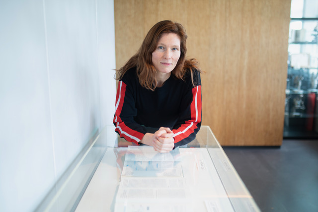
  

    <h3><a href="https://www.cwi.nl/en/people/laura-hollink/" target="_blank" rel="noopener noreferrer">Laura Hollink</a></h3>
    
<strong>Professor of Responsible AI in Culture &amp; Media at Utrecht University, researcher and management team member at CWI</strong>

    
Laura Hollink is Professor of 'Responsible AI in Culture &amp; Media' at Utrecht University. She is also a researcher and member of the management team at CWI, the Dutch national research centre for Mathematics and Computer Science. She investigates bias, diversity and inclusivity in AI systems that are used in the culture and media sectors, such as recommender systems, LLMs and knowledge graphs. To ensure societal relevance of her work, she maintains close, long-term collaborations with societal partners in two interdisciplinary labs: she is co-director of the Cultural AI Lab, and co-applicant of the NWA funded ELSA Lab on AI, Media and Democracy.

  

  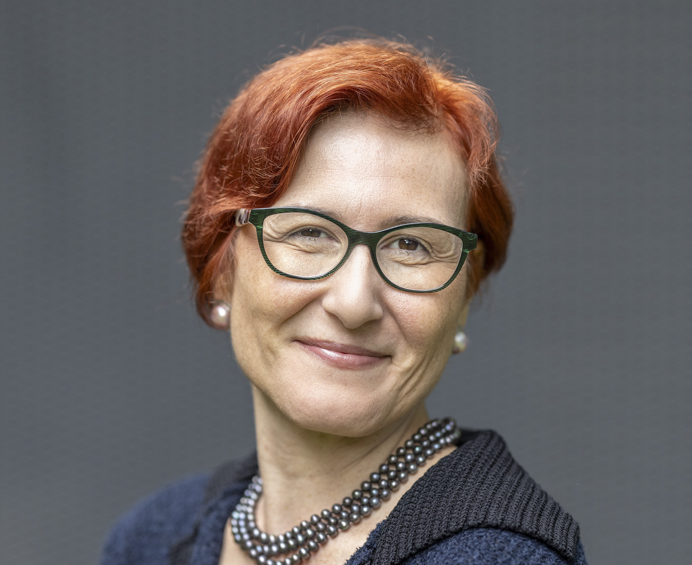
  

    <h3><a href="https://www.uu.nl/medewerkers/PYolumBirbil" target="_blank" rel="noopener noreferrer">Pınar Yolum</a></h3>
    
<strong>Professor of Trustworthy AI at Utrecht University</strong>

    
Pınar Yolum is Professor of Trustworthy AI at Utrecht University, where she leads the Responsible AI research group within the Department of Information and Computing Sciences. Her recent research focuses on human–AI collaboration, with an emphasis on trust, autonomy, and privacy. Pınar serves on the Editorial Boards of Journal of AI Research, Journal of Autonomous Agents and Multiagent Systems, and IEEE Internet Computing. She is the program leader of the AI Master’s program at Utrecht University, co-founder of the Global Justice Investigations Lab, and an active member of the Hybrid Intelligence Center. She regularly contributes to activities to promote women participation in computer science. She is an enthusiastic reader and a restless skier.

  

  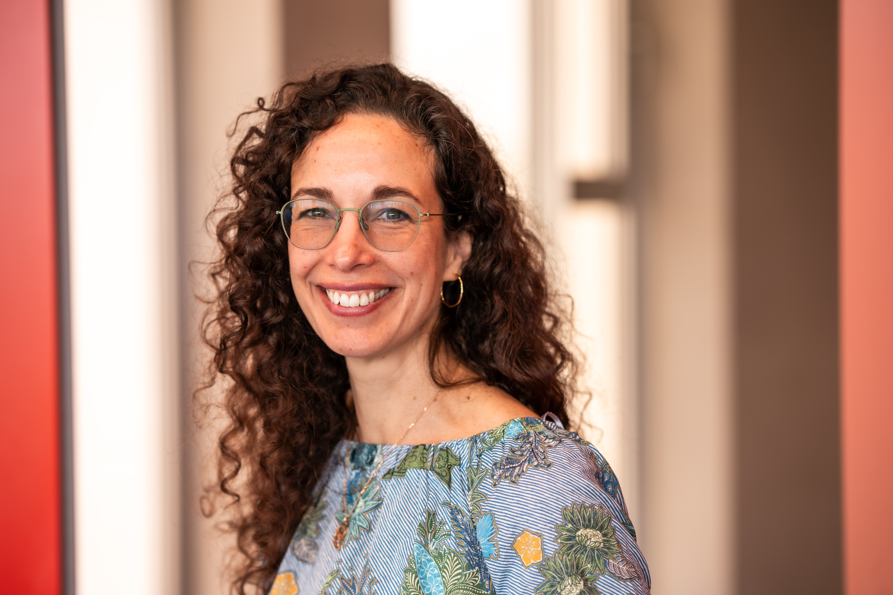
  

    <h3><a href="https://www.cwi.nl/en/people/vanessa-evers/" target="_blank" rel="noopener noreferrer">Vanessa Evers</a></h3>
    
<strong>Director at CWI, Chief Science Advisor at the Ministry of Education, Science and Culture (OCW), Full professor and Chair of Human Media Interaction at University of Twente</strong>

    
Vanessa Evers is the director of CWI, the National Institute of Mathematics and Computer Science in the Netherlands. She is also Chief Science Advisor for the Ministry of Education, Science and Culture (OCW) of the Dutch government. Apart from that, she is a full professor and Chair of Human Media Interaction at the computer science department of the University of Twente in the Netherlands. She is also founder and scientific director of the DesignLab at the University of Twente. Vanessa Evers is a visiting professor of Computer Science at Nanyang technological University in Singapore and was the founding Director of the Institute for Science and Technology for Humanity (2019-2022). Finally, she is a member of the supervisory board of Radboud University in the Netherlands. She is Co-chair of the World Economic Forum's Global Future Council on Physical AI and Autonomous Systems and in the Advisory Board of the WASP-HS Wallenburg foundation, and the Global Learning Council. Her research interests focus on Social Artificial Intelligence and Robotics; the societal impact of AI, autonomous systems and robots; human-robot collaboration as well as cross-cultural aspects of Human Machine Interaction. Vanessa has taught courses on Human Computer Interaction, Computer Mediated Communication, Technology and Teamwork, and Social Robotics at the undergraduate and graduate level, she also taught executive training courses, developed online courses and courses for continuing education.

  

  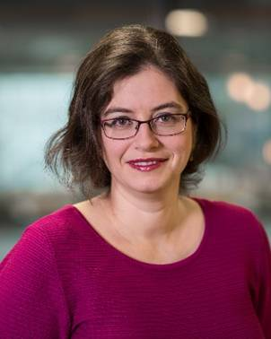
  

    <h3><a href="https://personen.utwente.nl/m.vlasiou" target="_blank" rel="noopener noreferrer">Maria Vlasiou</a></h3>
    
<strong>Full Professor at the University of Twente, Research Fellow of the European research institute EURANDOM, Director of the Dutch Network on the Mathematics of Operations research, LNMB</strong>

    
Maria Vlasiou's research centres on the performance of stochastic processing interacting networks. She develops mathematical tools in performance evaluation, optimisation, control, and decision making and applies these tools to design new algorithms that can be deployed in data centres, the electricity grid, communication systems, high-tech manufacturing and beyond. Prof. Vlasiou has received the best paper award in ICORES 2013, the Marcel Neuts student paper award in MAM8, the 3rd prize of the 8th conference in Actuarial Science, the 2022 the UPS George D. Smith prize of INFORMS, and the Hypatia chair of the University of Twente. She currently serves as an Associate Editor for IISE Transactions, Mathematical Methods of Operations Research, OR Spectrum, and INFOR.

  

  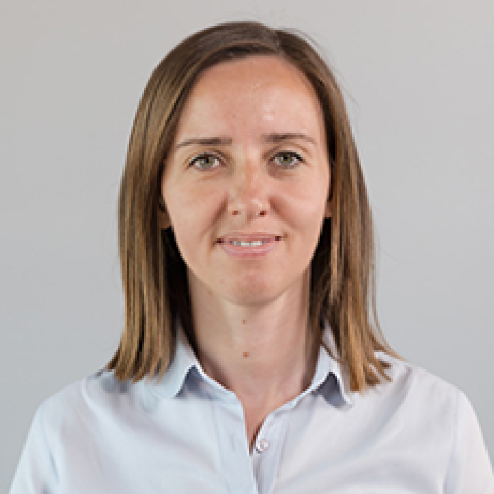
  

    <h3><a href="https://people.utwente.nl/ozlem.durmaz" target="_blank" rel="noopener noreferrer">Özlem Durmaz Incel</a></h3>
    
<strong>Senior Associate Professor and Chair of the Pervasive Systems research group at the University of Twente</strong>

    
Özlem Durmaz Incel is a Senior Associate Professor and Chair of the Pervasive Systems research group at the University of Twente, where she leads a team of over thirty researchers working across the end-to-end IoT stack. She obtained her PhD in Computer Science at the University of Twente. Before returning to Twente, she was a faculty member at Galatasaray University and then at Boğaziçi University in Istanbul. With more than fifteen years of experience as a systems builder, her research bridges physical sensing and intelligent action: resource-efficient sensing, Edge AI, and multimodal sensing, spanning from highly constrained earables to large-scale environmental networks. Her interests include wearable computing, human activity and well-being recognition, behavioural biometrics, and the Internet of Things. She serves as Associate Editor for the Proceedings of the ACM on Interactive, Mobile, Wearable and Ubiquitous Technologies (PACM IMWUT) and on the editorial board of IEEE Internet Computing.

  

  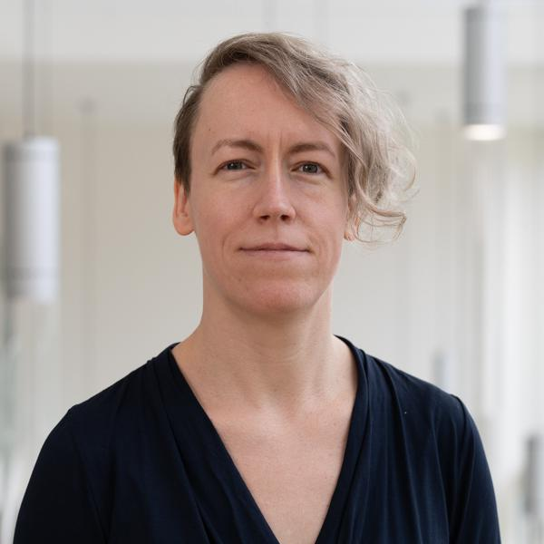
  

    <h3><a href="https://www.ru.nl/en/people/utz-c" target="_blank" rel="noopener noreferrer">Christine Utz</a></h3>
    
<strong>Assistant Professor in the Digital Security group at Radboud University</strong>

    
Christine Utz is an assistant professor in the Digital Security group at Radboud University. With a background in computer science and law, she conducts empirical research that studies privacy and digital rights from both technical and user-centered perspectives.

  

## Organizing Committee

  

    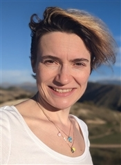
    

      <a href="https://www.uu.nl/staff/KLabunets">Kate Labunets</a>General Co-Chair 
      Utrecht University 
      Netherlands
    

  

  

    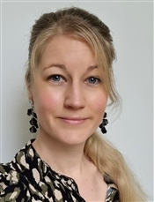
    

      <a href="https://www.uu.nl/staff/MMAdeGraaf">Maartje de Graaf</a>General Co-Chair 
      Utrecht University 
      Netherlands
    

  

  

    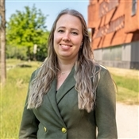
    

      <a href="https://www.uu.nl/staff/IRvanEngelenhovenLenting">Kimberley van Engelenhoven-Lenting</a>Local Chair 
      Utrecht University 
      Netherlands
    

  

  

    
    

      <a href="https://www.uu.nl/staff/MRadli">Martina Radli</a>Administration Liaison 
      Utrecht University 
      Netherlands
    

  

  

    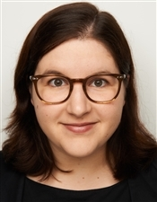
    

      <a href="https://www.uu.nl/staff/HJHauptmann">Hanna Hauptmann</a>Program Chair 
      Utrecht University 
      Netherlands
    

  

  

    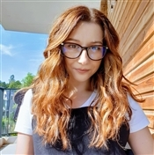
    

      <a href="https://www.uu.nl/staff/RTRadulescu">Roxana Radulescu</a>Poster Chair 
      Utrecht University 
      Netherlands
    

  

  

    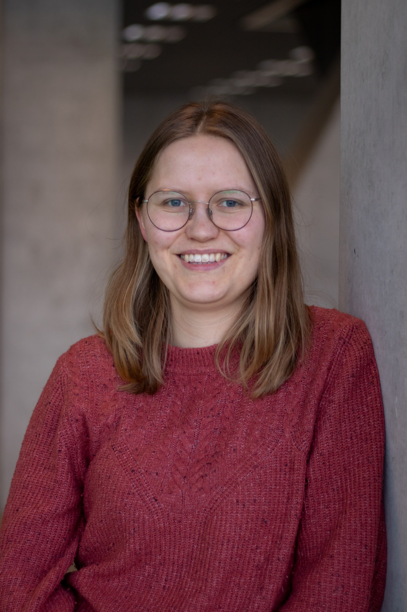
    

      <a href="https://www.uu.nl/staff/SSKerkhove">Sylvia Kerkhove</a>Finance &amp; Sponsors Chair 
      Utrecht University 
      Netherlands
    

  

  

    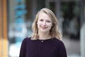
    

      <a href="https://www.uu.nl/staff/KDinnissen">Karlijn Dinnissen</a>Communication Co-Chair 
      Utrecht University 
      Netherlands
    

  

  

    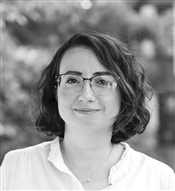
    

      <a href="https://www.uu.nl/medewerkers/FBAydemir">Fatma Başak Aydemir</a>Communication Co-Chair 
      Utrecht University 
      Netherlands
    

  

## Steering committee

- [Marieke Huisman](https://people.utwente.nl/m.huisman), Universiteit Twente (UT)
- [Mariëlle Stoelinga](https://personen.utwente.nl/m.i.a.stoelinga), Universiteit Twente (UT)
- [Sophie Lathouwers](https://www.sophielathouwers.nl/), TNO
- [George Fletcher](https://www.tue.nl/en/research/researchers/george-fletcher), Eindhoven University of Technology
- [Machiel van der Bijl](https://www.axini.com/nl/about/), Axini
- [Lu Cao](https://www.universiteitleiden.nl/en/staffmembers/lu-cao#tab-1), Leiden University
- [Jiapan Guo](https://www.rug.nl/staff/j.guo/), University of Groningen
- [Fatma Başak Aydemir](https://www.uu.nl/medewerkers/FBAydemir), Utrecht University

## Code of Conduct
Alice and Eve is dedicated to providing a harassment-free conference experience for everyone, regardless of gender, gender identity and expression, sexual orientation, disability, physical appearance, body size, race, age or religion. We do not tolerate harassment of conference participants in any form. Conference participants violating these rules may be sanctioned or expelled from the conference at the discretion of the conference organizers.
Harassment includes, but is not limited to:
- Verbal comments that reinforce social structures of domination related to gender, gender identity and expression, sexual orientation, disability, physical appearance, body size, race, age, religion.
- Sexual images in public spaces
- Deliberate intimidation, stalking, or following
- Harassing photography or recording
- Sustained disruption of talks or other events
- Inappropriate physical contact
- Unwelcome sexual attention
- Advocating for, or encouraging, any of the above behaviour

Participants asked to stop any harassing behavior are expected to comply immediately. If someone makes you or anyone else feel unsafe or unwelcome, please report it as soon as possible by contacting us ether in person or via email.

<!--
Ilaria Battiston (either in person or via [email](mailto:Ilaria Battiston <ilaria@cwi.nl>)) or Iris Groen (either in person or via [email](mailto:Iris Groen <i.i.a.groen@uva.nl>)).

This Code of Conduct was adapted from the [Geek Feminism Wiki anti-harassment policy](https://geekfeminism.fandom.com/wiki/Conference_anti-harassment/Policy).
-->

This Code of Conduct was adapted from the [Geek Feminism Wiki anti-harassment policy](https://geekfeminism.fandom.com/wiki/Conference_anti-harassment/Policy){:target="_blank" rel="noopener noreferrer"}.

## Sponsors

Interested in sponsoring Alice & Eve 2026? We'd love to hear from you — please contact our sponsor chair at [s.s.kerkhove@uu.nl](mailto:s.s.kerkhove@uu.nl).

**🥉 Bronze Sponsors**

  
  
  
  <a href="https://accss.nl" target="_blank" rel="noopener noreferrer">
    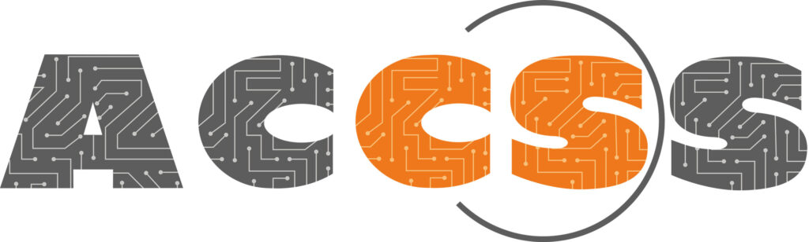
  </a>

**🥈 Silver Sponsors**

  

**🥇 Gold Sponsors**

  
  <a href="https://duckdblabs.com" target="_blank" rel="noopener noreferrer">
    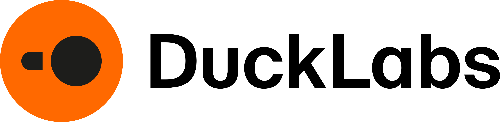
  </a>
  
  
  <a href="https://www.sidn.nl" target="_blank" rel="noopener noreferrer">
    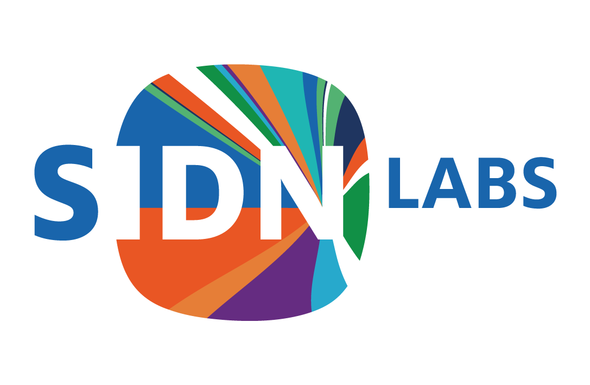
  </a>
  <a href="https://www.surf.nl" target="_blank" rel="noopener noreferrer">
    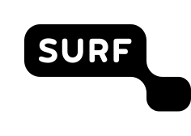
  </a>
  
  

## Contact Us

For any questions, feel free to reach out to us at [alice.eve@uu.nl](mailto:alice.eve@uu.nl).

## About Utrecht

Utrecht is one of the Netherlands' oldest and most vibrant cities, located right at the heart of the country. It is home to the iconic Dom Tower, medieval canal wharves, world-class museums, and three UNESCO World Heritage Sites. Utrecht Centraal station is the largest railway hub in the Netherlands — just 30 minutes from Amsterdam and 35–40 minutes from Schiphol Airport.

[Read more about Utrecht →](/aboutUtrecht)

## Accommodation

Although the Alice & Eve event is a one-day program, we warmly encourage you to consider extending your stay to enjoy the city, connect with fellow participants, and make the most of your visit in a relaxed and inspiring atmosphere.

Utrecht University offers **discounts for students** at [Bunk Utrecht](https://wearebunk.com/utrecht/) and [Stayokay Hostel Utrecht Centrum](https://www.stayokay.com/nl/hostel/utrecht-centrum), both within walking distance of the Alice & Eve venue.
Please find the discount codes on [this website](https://www.uu.nl/en/education/welcome-to-utrecht/before-arrival/arrange-housing/temporary-accommodation).

For non‑student attendees, a range of nearby hotels is available for accommodation.
